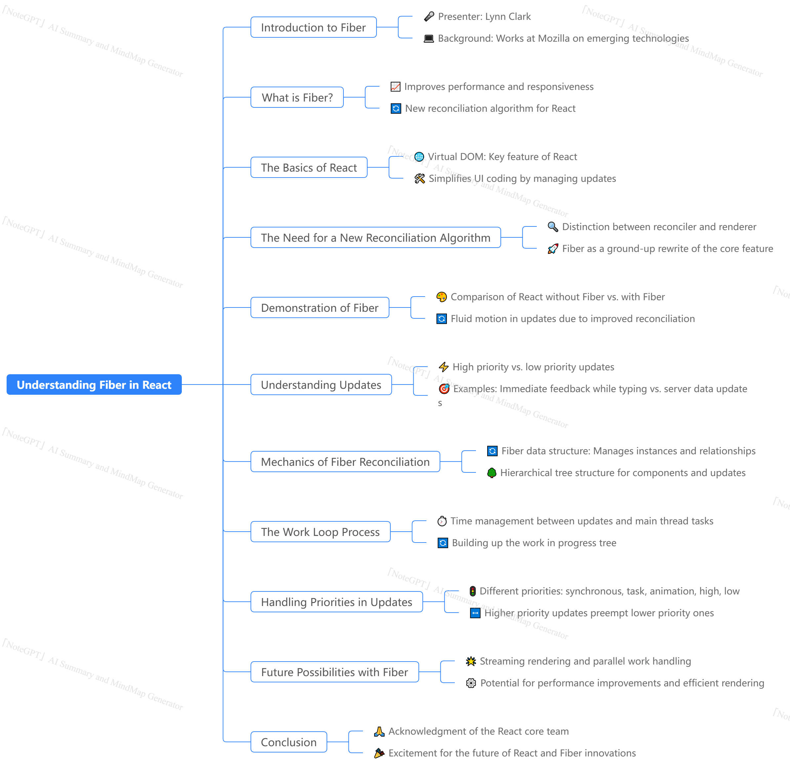

### Summary

In this comprehensive presentation, Lynn Clark introduces "Fiber," the new reconciliation algorithm for React, which significantly enhances the performance and responsiveness of complex applications. Clark begins with a brief overview of her background at Mozilla and her experience with emerging technologies. She highlights the importance of Fiber, which was identified as a highly anticipated topic among the conference attendees. The talk explains Fiber's functionality, focusing on its role in improving perceived performance through better prioritization and scheduling of updates. Clark distinguishes between high and low-priority updates and details how Fiber allows React to manage updates more efficiently by breaking them into smaller units of work. This cooperative scheduling approach enhances the UI's fluidity and responsiveness, ultimately leading to a smoother user experience. She also explores the technical underpinnings of Fiber, including the transition from the old stack reconciler to the new fiber reconciler and how this impacts the rendering process. Furthermore, she discusses the future implications of Fiber, such as streaming rendering and parallel work handling, suggesting that Fiber could lead to significant performance improvements in React applications.

### Highlights

- 🎉 **Introduction to Fiber**: Lynn Clark introduces Fiber, the new reconciliation algorithm for React, which enhances performance and responsiveness.
- 📊 **Reconciliation Algorithm**: Fiber separates the reconciliation process from the rendering, allowing for more efficient updates.
- 🔄 **High vs. Low-Priority Updates**: Clark explains the distinction between high-priority updates (like typing) and low-priority updates (like server data), emphasizing their impact on user experience.
- ⚙️ **Cooperative Scheduling**: Fiber introduces cooperative scheduling, allowing React to pause and resume work to prioritize more urgent tasks.
- 🌐 **Future of React**: Clark discusses future possibilities for React, including streaming rendering and parallel processing capabilities enabled by Fiber.
- 🔍 **Technical Insights**: The talk delves into the technical structure of Fiber, including its use of a new data structure to manage updates and relationships between components.
- 🛠️ **Improved User Experience**: The enhancements brought by Fiber aim to make complex React applications more fluid and responsive, improving overall user satisfaction.

### Key Insights

- ⚡ **Perceived Performance Improvement**: Fiber significantly enhances perceived performance in React applications by allowing for prioritization of updates. This ensures that high-priority tasks, such as user interactions, are processed quickly, leading to a more responsive interface. In contrast, low-priority updates, which can be delayed without a noticeable impact, are handled in a way that does not interfere with the user experience.

- 🔄 **Separation of Concerns**: Fiber's architecture separates the reconciliation algorithm from the rendering engine, allowing developers to leverage different rendering targets beyond the DOM. This modularity means React can more efficiently adapt to various platforms, including virtual reality and native applications, broadening its applicability and performance capabilities.

- 📈 **Efficient Update Management**: The new reconciliation process allows React to break updates into smaller tasks that can be interleaved with rendering tasks. This means that while one part of the application is being updated, React can pause and allow the main thread to handle other tasks, such as animations or user inputs, enhancing the overall responsiveness of applications.

- 🕰️ **Prioritization of Updates**: Fiber introduces a priority system for updates, categorizing them into synchronous, task, animation, high, low, and offscreen priorities. This prioritization ensures that more critical updates are processed first, which is vital for maintaining a smooth user experience, particularly in applications that involve heavy user interaction.

- 🌲 **Use of Fiber Data Structure**: The Fiber reconciler utilizes a new data structure that allows it to keep track of the relationships and state of components more efficiently. This structure not only aids in managing updates but also helps in creating a more consistent UI by preventing potential discrepancies during the rendering process.

- ⏳ **Double Buffering Technique**: Fiber employs a double buffering technique, which allows React to reuse existing objects in memory when rendering updates. This minimizes memory allocation and garbage collection overhead, resulting in faster rendering times and improved performance.

- 🚀 **Future Enhancements**: The architecture of Fiber sets the stage for future innovations in React, such as streaming rendering, which allows components to render as they arrive rather than waiting for the entire app to load. This could lead to faster initial render times and improved user experiences, especially in applications with a large number of components.

In conclusion, Lynn Clark's talk on Fiber presents a thorough understanding of its architecture and benefits, emphasizing its potential to transform how React applications are built and experienced. By improving responsiveness and fluidity, Fiber not only enhances user satisfaction but also paves the way for innovative developments in web technologies. The implications of these advancements are vast, hinting at a future where React can handle complex applications with ease and efficiency.

# Understanding Fiber: Enhancements in React's Reconciliation Process

## Introduction

In the world of web development, user experience is paramount. **Fiber**, a new reconciliation algorithm introduced in React, aims to significantly improve the perceived performance and responsiveness of complex applications. Lynn Clark, an expert from Mozilla, emphasizes the importance of Fiber in her presentation, highlighting that it was the most requested topic for discussion at the conference. This chapter will delve into the intricacies of Fiber, explaining its purpose, functionality, and the transformative impact it has on React applications. Key concepts such as **reconciliation algorithm**, **virtual DOM**, and **cooperative scheduling** will be defined and contextualized to aid understanding.

## The Significance of Fiber

Fiber serves as the backbone of React’s reconciliation process, allowing for more efficient updates to the user interface. By improving how React manages updates, Fiber enhances the **perceived performance** of applications. It achieves this through a sophisticated structure that distinguishes between different types of updates—specifically **high priority** and **low priority** updates. This distinction is crucial for creating fluid interactions, especially in applications where users expect immediate feedback, such as typing in a text box.

### What is Fiber?

Fiber is essentially a complete rewrite of React's core reconciliation algorithm, which is responsible for updating the UI. The introduction of Fiber allows React to separate the logic that determines how to update the UI from the actual rendering process. This separation enables React to use different renderers for various platforms, including mobile and virtual reality, making it versatile and adaptable.

- **Virtual DOM**: The initial feature of React that allowed developers to describe what the UI should look like without manually manipulating the DOM.
- **Reconciliation Algorithm**: The process through which React determines what changes need to be made to the UI based on the new state of the application.

## Key Mechanics of Fiber

Fiber introduces a number of important concepts that enhance React's performance:

### 1. Prioritization of Updates

One of the standout features of Fiber is its ability to prioritize updates. Updates can be categorized as high priority (such as user interactions) or low priority (such as data fetching). For instance, when a user types rapidly, React should prioritize rendering the keystrokes over updating less critical information, such as the number of likes on a post.

- **High Priority Updates**: Require immediate feedback and are prioritized over lower priority tasks.
- **Low Priority Updates**: Can be delayed without impacting user experience.

### 2. Cooperative Scheduling

Fiber employs a technique known as **cooperative scheduling**, allowing the main thread to pause work on one task to handle more pressing tasks. This method improves the responsiveness of applications by ensuring that critical updates are not held back by less urgent ones.

- **Main Thread**: The single thread responsible for executing all JavaScript, DOM manipulations, and layout computations. Fiber efficiently manages this resource to avoid bottlenecks.

### 3. Work Units

Fiber breaks down the reconciliation process into smaller, manageable units of work. This approach allows React to process updates incrementally and return control to the main thread, enabling it to handle other tasks simultaneously.

## The Fiber Reconciler in Action

To illustrate how Fiber operates, consider a typical user interface with interactive elements. When a user clicks a button to modify a list of numbers, React executes several steps:

- **Building the Work in Progress Tree**: React first creates a "work in progress" tree that reflects the upcoming changes, without immediately altering the DOM.
- **Phased Approach**: The reconciliation process is divided into two phases: the **reconciliation phase**, which can be interrupted, and the **commit phase**, which must complete without interruptions. This structure helps maintain UI consistency while allowing for responsive interactions.

## Real-World Applications and Examples

Clark provides a practical demonstration of Fiber's functionality using a simple React application. By toggling the width of a triangle and updating numbers, she illustrates how Fiber manages two different types of updates—one that is frequent but computationally light, and another that is heavy but infrequent. The result is a smoother user experience, demonstrating the importance of Fiber in real-world applications.

## Implications and Future Directions

Fiber not only enhances the current performance of React applications but also sets the stage for future advancements. The potential for **streaming rendering** and **parallel processing** opens exciting avenues for improving how React handles complex applications.

### Potential Future Enhancements

- **Streaming Rendering**: This would allow React to begin rendering components as they are received, rather than waiting for the entire component tree to load.
- **Parallel Processing**: Fiber's architecture will facilitate the execution of tasks in parallel, significantly reducing render times and improving performance.

## Conclusion

In conclusion, Fiber represents a significant leap forward for React, enhancing its ability to handle complex applications with improved performance and responsiveness. By prioritizing updates, introducing cooperative scheduling, and breaking work into smaller units, Fiber not only addresses existing challenges in the React ecosystem but also lays the groundwork for future innovations. As developers continue to explore the capabilities of Fiber, it is clear that this new reconciler will play a pivotal role in shaping the future of web development. The advancements brought by Fiber are not merely technical improvements; they are essential for creating a more dynamic and user-friendly web experience.
